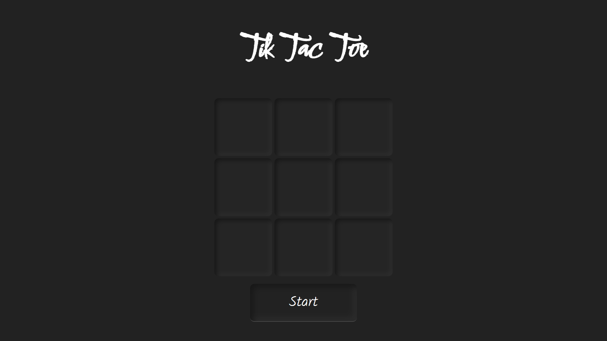

# Tic-Tac-Toe
## Want to play Tic Tac Toe with your friend?
## Just click on the link below
### [Tic Tac Toe](https://sagar-sharma-7.github.io/Tic-Tac-Toe/)

------

## Preview

  

----

## Editor used 

## Built with 
 
 
 
 
 

 ------

 ## Cloning this repositary using command line
 1. Open **Git Bash**.
 1. Change the current working directory to the location where you want the cloned directory.
 1. Type `git clone https://github.com/Sagar-Sharma-7/Tic-Tac-Toe.git`
 1. Press **Enter** to create the clone of this repositary.